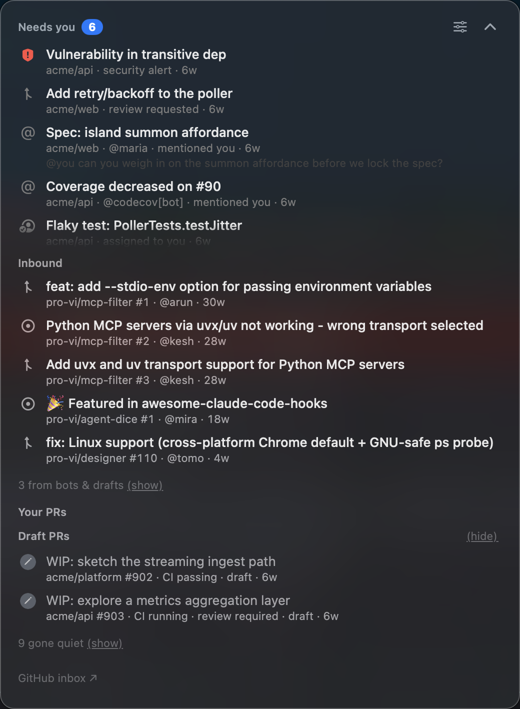
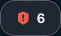
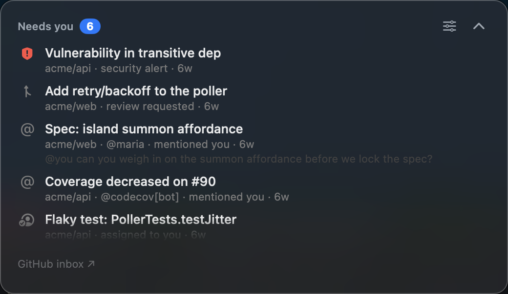
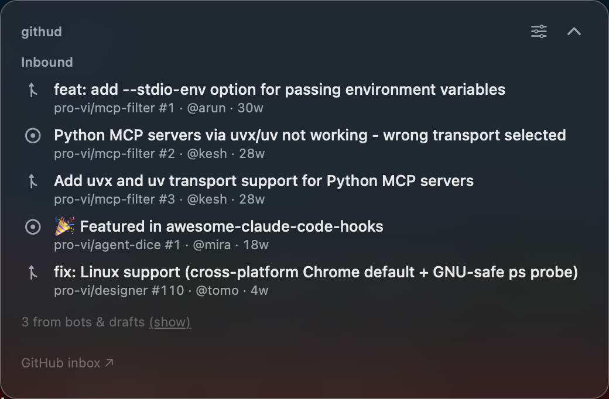
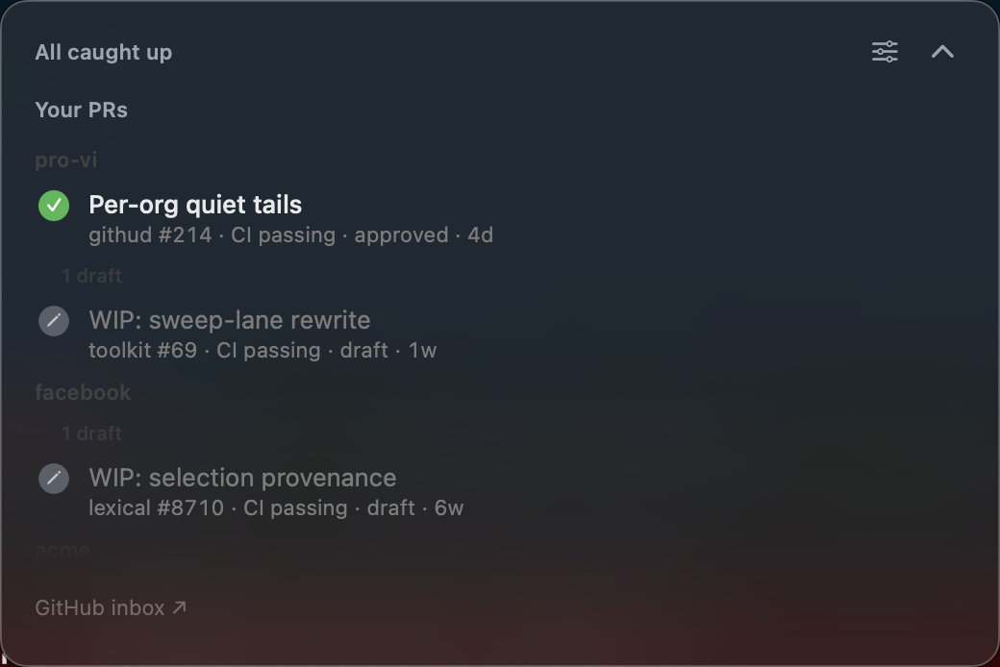
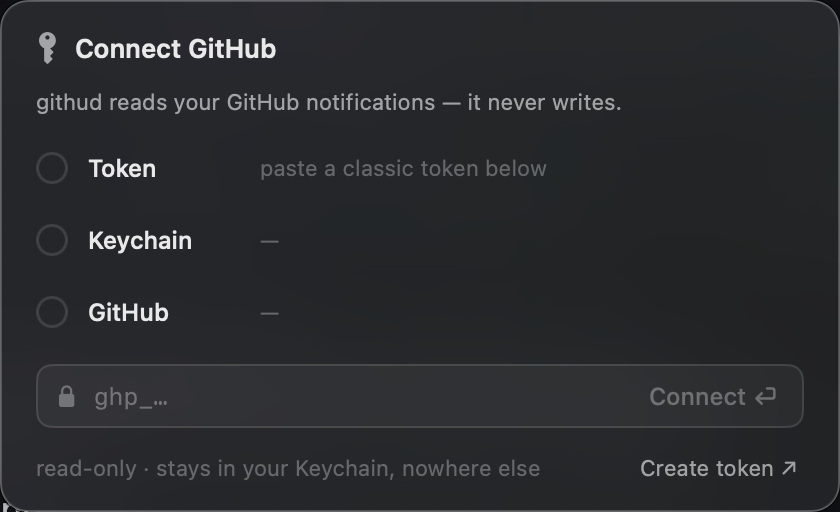
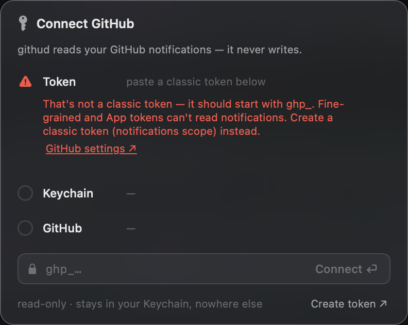
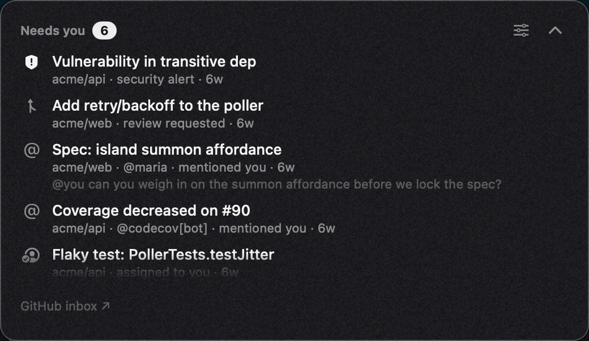
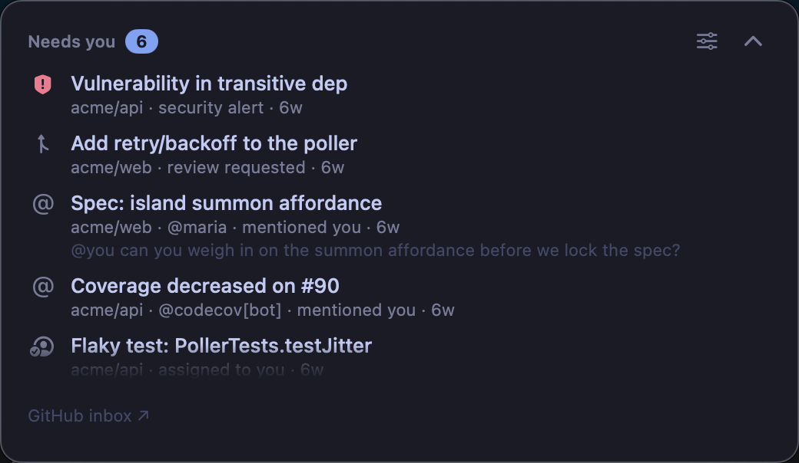

<div align="center">

# githud

**A calm macOS menu-bar HUD that answers one question: does GitHub need me right now?**

[](https://github.com/pro-vi/githud/actions/workflows/ci.yml)
[](LICENSE)




</div>

---

## The problem

GitHub sends you everything. A repo you starred once, a bot commenting on CI, a thread
you already replied to, someone else's review request. By Wednesday the inbox has 50
unread items and you stop reading it — which is exactly when the one that mattered
arrives.

githud does not mirror that inbox. It answers a smaller question, all day, in the corner
of your eye: **is there anything I actually have to do?**

Most of the time the answer is no, and githud is a small quiet pill under the menu bar:

<div align="center"></div>

Click it and you get the whole picture. On a real account this is usually about **50
notifications down to a handful**.

> **The moat is signal quality and trust, not the glass.** The one thing that kills a
> tool like this is a **miss** — so githud is built to never silently hide something you
> needed, and to let you audit what it hid.

## Three lanes

### Needs you — what you actually have to act on



Review requests, mentions, assignments, and human replies on your own PRs. Bots, CI,
watch-the-repo noise, and threads where you already had the last word are suppressed.

This lane has **two** sources, and the second one is the point. One is your
notifications, filtered. The other is a standing search for reviews you owe — because a
review request stays owed after you read the notification, and a read notification is
gone from the GitHub inbox forever. Without that search, those PRs are invisible. That
is a miss, and misses are the thing that kills this tool.

### Inbound — what is at your door



Every open issue and PR that someone **else** opened on repos you own, longest wait
first. It is a triage queue, so the contributor who has been waiting since December
leads, not the one who wrote yesterday. Bot and draft items hold back to a quiet count.

One search per poll. No watch settings to configure.

### Your PRs — how your own work is doing



Every open PR rolled up to one state: **blocked** (CI failing, changes requested, or
conflicts), **ready** (mergeable and approved), **waiting**, or **draft**.

It never invents a state it cannot back: no checks is not passing, and "checking…" is
not ready.

With work across several orgs the lane can wear titles, as above. Each org gets its own
group ending in its own drafts and then its own gone-quiet PRs. Fold an org you are not
working on today and it collapses to one line that **hides but still counts** —
`acme · 4, 5 drafts, 2 gone quiet` — so nothing disappears silently. Drag orgs into the
order you want. Both settings stay on that machine, because "which orgs matter" is a
property of the desk, not the account.

When your inbox is clear, the pill becomes a live gauge of your PRs instead of going
blank.

## Install

**Requires macOS 13 or newer.** Universal — Apple silicon and Intel.

### Download

Grab the latest `.zip` from [**Releases**](https://github.com/pro-vi/githud/releases),
unzip, and drag `githud.app` to `/Applications`.

> [!IMPORTANT]
> The build is **not signed yet** — there is no Apple Developer ID certificate on this
> project. macOS Gatekeeper will refuse a plain double-click. Either **right-click the
> app → Open** the first time, or:
> ```sh
> xattr -d com.apple.quarantine /Applications/githud.app
> ```

### Build it yourself

You need a Swift 5.9+ toolchain. Command Line Tools is enough — full Xcode is not
needed.

```sh
git clone https://github.com/pro-vi/githud.git
cd githud
scripts/build-app.sh     # build + assemble + ad-hoc-sign build/githud.app
scripts/run-app.sh       # launch it
```

## Setup

githud needs a **classic** GitHub Personal Access Token.

On first run the island shows a **Connect GitHub** card. Paste the token, press <kbd>⏎</kbd>,
and githud stores it in your login Keychain.

<div align="center"></div>

Create the token at <https://github.com/settings/tokens> with the **`notifications`**
scope. Add **`repo`** as well, so githud can tell a human reply apart from a bot on your
private PRs and read the state of your private open PRs.

The card keeps a three-row ledger — Token, Keychain, GitHub — and a row only fills in
when the real call came back, so it never claims a step it did not do. When a step
fails it tells you what to do rather than just failing:

<div align="center"></div>

<details>
<summary><b>Why a classic token, specifically?</b></summary>

<br>

This is not a preference, it is a wall. GitHub's Notifications API only recognises
classic PATs. Fine-grained PATs and GitHub App tokens are rejected — 403 or an empty
response — no matter what scopes you give them. githud checks the shape of what you
paste and refuses a fine-grained token **before** storing anything, because otherwise
you would get a silent empty inbox forever and blame the app.

If GitHub ever extends Notifications API support to fine-grained tokens, githud will
move with it.

</details>

<details>
<summary><b>Setting the token from the terminal instead</b></summary>

<br>

The card writes an ordinary Keychain item, so you can write it yourself. Use the
**interactive** `-w` — with no value on the command line — so the token is typed at a
hidden prompt and never lands in your shell history or process list:

```sh
security add-generic-password -s githud.github.pat -a github -w
# → prompts "password data for new item:" — paste the ghp_… token (input is hidden)
```

Avoid `-w 'ghp_…'` with the token inline. That leaks it into shell history and `ps`.

</details>

## Everyday use

| | |
|---|---|
| **Summon from anywhere** | <kbd>⌃</kbd><kbd>⌥</kbd><kbd>G</kbd>, or click the menu-bar item |
| **Move through rows** | <kbd>↑</kbd> <kbd>↓</kbd> |
| **Open on GitHub** | <kbd>⏎</kbd> or click the row |
| **Peek at a row** | <kbd>space</kbd> |
| **Put it away** | <kbd>esc</kbd>, or click anywhere else |
| **Settings** | right-click the menu-bar item → *Settings…* |

The global hotkey uses no Accessibility permission — macOS never asks you to approve
anything.

Settings live on the glass, inside the island itself. There you pick the theme, choose
which reasons reach "Needs you", turn on the default-off sections, set launch at login,
and open two more cards: **Pill style** (how the collapsed pill holds the inbound queue
— *Door first*, *Side by side — quiet mark*, or *Side by side — with the count*, each
previewed with your own live data, never a fake queue) and **Lens** (which orgs lead,
which are folded, and their order).

## Themes

Nine of them. The monochrome themes carry state by glyph **shape and weight**, not by
hue — so they stay calm, and they stay readable if you do not see colour the way the
designer does.

| Color *(default)* | Geist Mono | Tokyo Night |
|---|---|---|
|  |  |  |

Also: **GitHub**, **Dracula**, **Nord**, **Catppuccin**, **Solarized Dark**, and
**Solarized Light**.

## What githud will not do

**It is read-only, on purpose.** githud never marks a thread read, never replies, never
merges, never closes. It opens things on github.com and you decide.

That is a deliberate limit, not a missing feature. Marking read on your behalf can bury
something you needed, and GitHub stays the only authority on what you have actually
read.

**It will not claim an all-clear it did not earn.** If a source did not confirm on this
tick, the pill says *"clear so far"*, not *"clear"*. A checkmark means all three lanes
came back clean this session — not that a request failed quietly.

**It will not take your focus.** The island is a non-activating panel. It never steals
keyboard focus from what you are doing, and it shows over full-screen Spaces.

**It is cheap.** Polling is conditional on GitHub's `X-Poll-Interval`, so an unchanged
inbox costs a `304 Not Modified` and nothing else. Around 0% CPU between polls.

## Audit what it hid

Trust is earned, not assumed. The island footer links to your full GitHub inbox so you
can check whether anything githud suppressed actually needed you.

From the terminal, you can see the same decision with the hidden set spelled out:

```sh
.build/debug/githud probe --show-items --show-suppressed
```

If you find a miss, [**that issue is the single most valuable thing you can
file**](.github/ISSUE_TEMPLATE/missed-notification.md).

## How it is built

- **`Sources/GithudCore`** — pure logic, no AppKit, testable without a window server.
  `SignalClassifier` decides reason → action-required / fyi / noise, and knows about
  bots and about you. `RadarReading` holds all the state and policy of the "Needs you"
  lane. `PulsePresenter` does the same for your PRs, including the owner lens.
  `PlainWords` owns every user-facing string, so no two surfaces can word the same
  thing differently. Around thirty types; those four carry most of the decisions.
- **`Sources/GithudApp`** — the AppKit shell: a non-activating `NSPanel` overlay with an
  `NSVisualEffectView` island, `PollScheduler` for live polling, and the status item.
- **`Tests/`** — a zero-dependency runner. XCTest and swift-testing need full Xcode,
  which this project does not use, so the tests are a plain executable that exits
  non-zero on failure. **1704 assertions**, no network, no PAT, no GitHub account.

```sh
scripts/test.sh          # the whole suite
scripts/leak-check.sh    # fails if private data reaches a tracked file
scripts/screenshots.sh   # regenerate the images in this README from fixtures
```

**[`docs/TOPOLOGY.md`](docs/TOPOLOGY.md) is the one document that describes what githud
is now.** It holds the rules the interface is built from — the operators, the laws they
obey, and the exemptions. Read it before changing behaviour. This README lists
features, which change every release; the topology holds the rules underneath, which do
not.

> `loop/` and `docs/plans/` are this project's AI-pairing dev log — a record of how each
> change was decided, never updated afterwards, and not required reading.

## Contributing

Pull requests are welcome — see [CONTRIBUTING.md](CONTRIBUTING.md).

The most valuable contribution is not code. githud's whole premise is a trust bet, so
the two issue templates — [**missed
notification**](.github/ISSUE_TEMPLATE/missed-notification.md) and [**false
alarm**](.github/ISSUE_TEMPLATE/false-alarm.md) — turn your daily use into the signal
that keeps the classifier honest. Filing one of those, with no code at all, is the
highest-leverage thing you can do here.

## Status

All three lanes work end to end: live polling → signal and trust filtering → the calm
pill → summon → the list → open on GitHub.

macOS only. Not built yet: stars and forks, and a signed release.

## License

[MIT](LICENSE)
